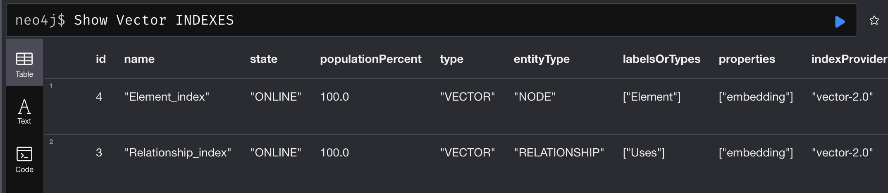
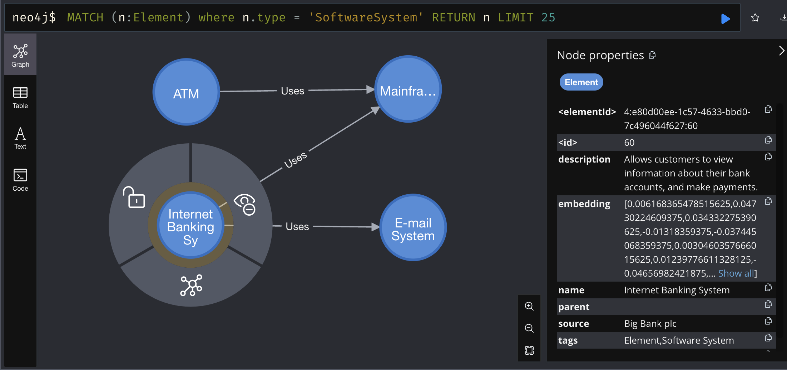

# Neo4j Desktop

https://neo4j.com/download-thanks-desktop/?edition=desktop&flavour=osx&release=1.5.9&offline=false

## Neo4j Desktop for Windows
https://neo4j.com/artifact.php?name=neo4j-desktop-1.5.9-setup.exe

## Neo4j Desktop for Mac OS
https://neo4j.com/artifact.php?name=neo4j-desktop-1.5.9.dmg

## Neo4j browser

https://github.com/neo4j/neo4j-browser

https://github.com/neo4j/neo4j-browser/releases/tag/5.15.0

## Spring AI

https://spring.io/projects/spring-ai

https://docs.spring.io/spring-ai/reference/1.0-SNAPSHOT/index.html

https://docs.spring.io/spring-ai/reference/1.0-SNAPSHOT/api/embeddings/mistralai-embeddings.html

https://docs.spring.io/spring-ai/reference/1.0-SNAPSHOT/api/chat/mistralai-chat.html

https://docs.spring.io/spring-ai/reference/1.0-SNAPSHOT/api/vectordbs/neo4j.html


### Neo4j Cypher

Show Vector INDEXES

```sql
SHOW INDEXES YIELD name, type, entityType, labelsOrTypes, properties, options 
WHERE type = 'VECTOR' 
RETURN name, entityType, labelsOrTypes, properties, options
```



Show SoftwareSystem Nodes

```sql
MATCH (n:Element) where n.type = 'SoftwareSystem' RETURN n LIMIT 25
```

